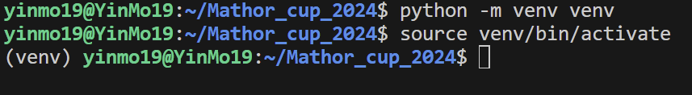
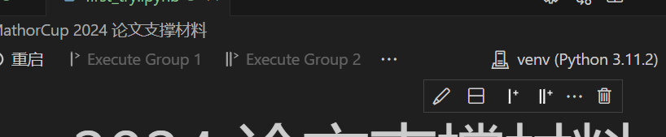

# Mathor Cup 2024 比赛论文
## YinMo,Sen

这是Mathor Cup 2024 的论文。

---
## 关于Python的虚拟环境
在尝试写python代码之前，由于不出现包冲突，我们建议先进入虚拟环境。在命令行输入（现在处于这个项目的根文件夹下）
```shell
python -m venv venv
source venv/bin/activate
```
现在你应该要看到

之后如果重新进入前面没有出现`(venv)`字样就需要重新激活虚拟环境
```shell
source venv/bin/activate
```
想要退出虚拟环境只需要输入
```shell
deactivate
```

在启用虚拟环境之后，所有需要的包都需要重新安装，使用下面的命令
```shell
pip install -r requirements.txt
```
其中如果添加了依赖项，需要在`requirements.txt`中以如下格式写明。
```
numpy==1.24.1
```
在创建好python的虚拟环境之后，我们还需要在jupyter中选择这个虚拟环境，例如

此时我们第一次运行笔记本会提醒我们虚拟环境中还没有内核，按照提示自行安装即可。


> 关于YinMo的画图，可能会使用latex来渲染文字和公式。如果没有安装latex可以在笔记本中注释掉
```python
config = {
    "text.usetex": True,
    "text.latex.preamble": r"\usepackage{CJK}",  # 预先导入CJK宏包处理中文
}
plt.rcParams.update(config)
```

